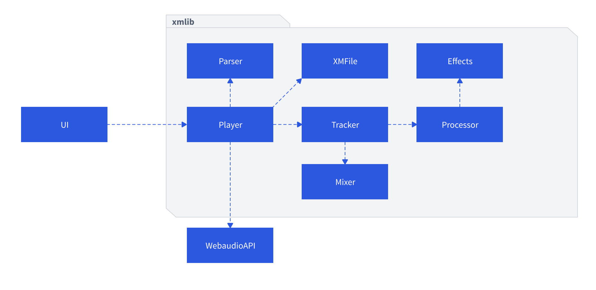
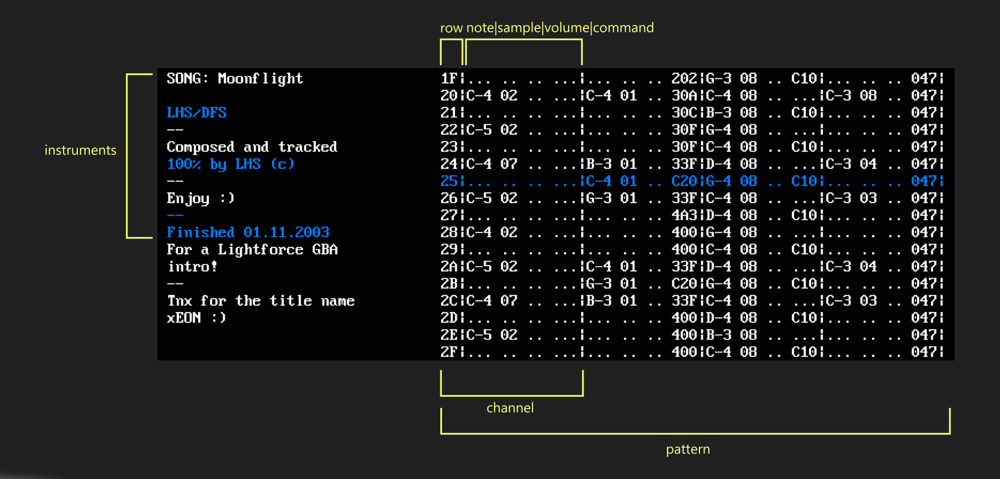
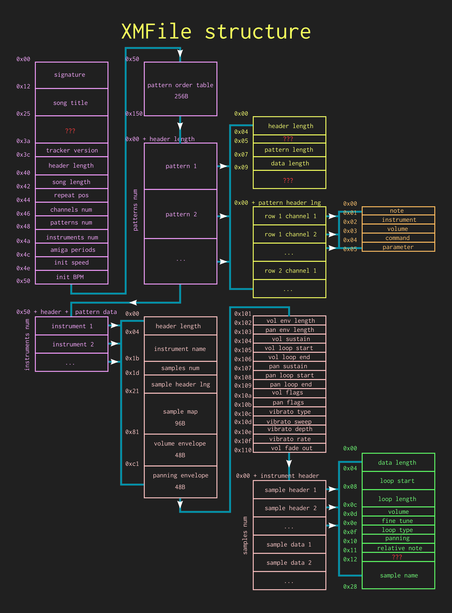

# XM PLAYER

Serverless player for XM tracker files. Contains a simple UI and XM engine, both written in TypeScript.

**Budget: ~150 hours of work.**

## Installation
* create folder `assets/mods` and move your own files to this directory (only files with XM extension are supported)
* type `npm install`
* type `npm start`
* connect to `localhost:1234/index.html`

## Architecture

* `UI` is very simple, uses WebCanvas and `Player` from `xmlib`
* `Player` uses `WebAudioAPI` for biquad filters and the `ScriptProcessorNode` for filling the output buffer. Everything else (including envelopes and effects) is implemented manually.
* `XMFile` is a structure of XM File
* `Parser` parses XM File from a binary file
* `Tracker` advances a context after each tick
* `Processor` is a sound processing engine
* `Mixer` mixes two channels and handles loops
* `Effects` contains implementation of effects as specified by XM format

## UI description

* UI is still work in progress. For now, only basics data is provided
* Max number of channels displayed is 6. XM format can have up to 32, though.

## XM File structure

* Not sure if this is 100% correct. Original documentation can be found [here](ftp://ftp.modland.com/pub/documents/format_documentation/FastTracker%202%20v2.04%20(.xm).html).

## TODO

* portamento doesn't sound properly for several tracks
* UI could benefit from certain attention
* not all effects are implemented
* big endian architectures are not yet supported

## License
--------

    Copyright 2019 DoDo

    Licensed under the Apache License, Version 2.0 (the "License");
    you may not use this file except in compliance with the License.
    You may obtain a copy of the License at

       http://www.apache.org/licenses/LICENSE-2.0

    Unless required by applicable law or agreed to in writing, software
    distributed under the License is distributed on an "AS IS" BASIS,
    WITHOUT WARRANTIES OR CONDITIONS OF ANY KIND, either express or implied.
    See the License for the specific language governing permissions and
    limitations under the License.